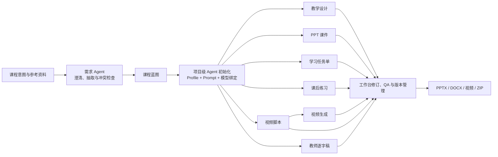

# 课启智造 · LessonForge AI

> 面向教师与教学团队的多 Agent 教学内容生产平台：从一句课程设想或一组参考资料出发，协同完成教学设计、PPT 课件、学习任务单、课后练习、视频脚本与教师逐字稿，并支持在线修订、质量检查、版本追踪和可编辑文件导出。

LessonForge AI 不是简单地把一个 Prompt 包装成生成按钮。项目围绕真实备课流程构建了一套可持续迭代的教学内容生产系统：先通过对话澄清需求，再形成统一课程蓝图，为每类产物初始化专属 Agent；生成过程中以强类型数据契约、项目记忆和质量门禁维持不同产物之间的一致性，最终交付可继续编辑的 PPTX、DOCX、视频与课程资源包。

## 核心能力

- **对话式课程创建**：从自然语言中提取课程主题、学习者特征、教学目标、课时安排和约束条件，持续记录字段来源、系统假设与需求冲突，确认后再创建正式项目。
- **多格式资料理解**：支持 PDF、DOCX、PPTX、TXT、Markdown、CSV、JSON 和常见图片；文本资料自动分块，图片与 PDF 可作为多模态上下文传给支持视觉能力的模型。
- **六类教学产物协同生成**：教学设计、PPT、学习任务单、课后练习、视频脚本和教师逐字稿拥有独立的 Agent Profile、Prompt、模型配置与任务工作台。
- **共享项目记忆**：统一索引需求、蓝图、材料、已有产物、教师决策、关键对话和 QA 结果。各 Agent 可并行启动，并在运行时按需读取其他 Agent 的最新成果。
- **可控的对话式修改**：支持内容编辑、结构重组、时长调整、上下文同步和 QA-only 等意图；可限定章节或页面范围，并提供锁定、Diff、版本恢复与人工确认机制。
- **Agent 化 PPT 生产**：从叙事结构、页面内容、视觉规划、动态布局、媒体生成到真实渲染质检形成完整流水线，支持逐页修订、模板切换和自动返修。
- **视频生成中心**：以视频脚本为输入，管理分镜级生成、重试、取消、续跑、视频资产、字幕与音频 QA；可通过协议适配接入支持视频或原生有声视频的服务。
- **可编辑交付**：导出 PPTX、DOCX、Markdown、视频、字幕和包含校验清单的 ZIP 课程包，便于教师继续修改、归档或交付。

## 业务工作流



六类内容 Agent 采用共享记忆架构，可在初始化后并行工作；视频生成具有明确的输入契约，需要先存在有效的视频脚本。一个 Agent 的修改不会无条件触发全项目重跑，教师可以按需执行上下文同步，控制成本与变更范围。

## 技术架构

项目采用前后端分离的模块化单体架构，兼顾本地开发效率、业务边界清晰度和后续服务化扩展能力。

| 层级 | 主要技术 | 职责 |
| --- | --- | --- |
| 前端 | Vue 3.5、TypeScript 5.7、Vite 6、Pinia、Vue Router、Element Plus | 教师控制台、需求对话、任务工作台、Agent 执行时间线、内容编辑、视频中心与模型设置 |
| API 与业务层 | Python 3.11+、FastAPI、Pydantic v2、Structlog | REST API、身份认证、文件上传、业务服务、强类型请求与响应 |
| Agent 编排 | LangGraph、LangChain、自研 Agent Core 与工具注册表 | 课程蓝图状态图、多角色协作、工具调用循环、Handoff、返修路由和执行预算控制 |
| 数据层 | SQLAlchemy 2 Async、SQLite、Alembic | 项目、产物、版本、任务、事件、Checkpoint、模型配置和项目记忆持久化 |
| 实时通信 | SSE、持久化 Generation Event / Pipeline Event | 流式输出 Agent 状态、工具调用和 QA 进度，并支持断线后的游标续传 |
| 文档与课件 | python-pptx、python-docx、PyPDF、CairoSVG、LibreOffice、Poppler | 资料解析、PPT/DOCX 生成、模板填充、页面渲染与视觉检查 |
| 多媒体 | FFmpeg、imageio-ffmpeg、可配置媒体 Provider | 图片、图表、视频、音频转写、字幕和媒体合成处理 |
| 工程化 | Docker Compose、Nginx、Pytest、Vitest、vue-tsc | 本地开发、单机部署、反向代理、自动化测试与类型检查 |

### 后端分层

- `api/v1` 只负责协议、鉴权和参数校验；主要业务逻辑沉入 `services`。
- `agent/core` 提供领域无关的 Agent Loop、状态、错误与门禁；教学设计、PPT、任务单、练习、视频脚本和逐字稿在 `agent/agents` 中实现各自的角色与工具。
- `schemas` 是产物数据契约，`models` 负责持久化模型，`renderers` 把结构化产物转换为最终可交付文件。
- `providers/llm` 屏蔽模型厂商差异，业务层只依赖统一的结构化生成和流式决策接口。

## 技术亮点

### 1. 状态图、任务调度与 Agent Loop 的混合编排

课程蓝图使用 LangGraph `StateGraph` 管理状态流转；项目级任务由支持并发和输入契约的调度器执行；复杂产物则进入通用 Agent Loop，在限定步数、Token 预算和工具权限内进行多轮“决策 → 工具调用 → 结果回喂 → 完成/Handoff”。这种分层方式既适合确定性的业务流程，也保留了 Agent 处理开放式编辑任务的灵活性。

### 2. 强类型 Artifact，而非不可控的长文本

核心产物均通过 Pydantic Schema 校验。教学设计进一步拆分为稳定的 `pedagogical_core` 与可动态调整的章节树，下游 Agent 只读取统一投影；页面、章节、目标等对象使用稳定 ID，使局部修改、引用追踪和跨版本对齐成为可能。Agent 输出只有通过结构、领域规则和发布门禁后才会形成新版本。

### 3. 带来源与版本的共享项目记忆

项目记忆不是简单拼接历史对话，而是把需求、蓝图、资料、产物、决策和 QA 结论保存为带来源、可信级别与版本号的结构化条目。上下文构建会按任务选择高价值信息、执行字符预算，并对大型兄弟产物生成可缓存的语义摘要；摘要失败时自动回退到确定性裁剪，不阻塞主任务。

### 4. 可观测、可恢复的长任务

Generation Run、Pipeline Run、Agent 步骤、工具调用和事件均会落库。前端通过 SSE 展示执行时间线，服务端支持 `Last-Event-ID` 游标续传；流水线在安全边界写入 Checkpoint，并提供暂停、恢复、取消、重试以及应用重启后的未完成任务恢复能力。

### 5. 面向真实编辑场景的人机协作

系统会区分生成、局部编辑、结构重组、润色、同步上下文和质量检查等意图，并记录修改作用域。锁定路径可以保护已确认内容，Diff 用于呈现实际变化；遇到候选版式或高影响决策时，运行时可以暂停并等待教师选择。发布结果明确区分 `applied`、`no_change` 和 `rejected`，避免失败修改覆盖正式版本。

### 6. PPT 从“内容大纲”走到“可用文件”

PPT 流水线由叙事、模板分析、页面内容、视觉规划、布局、媒体、编辑、视觉 QA 和修订等角色组成。系统内置多套 16:9 成品模板，通过角色与槽位映射保留原模板设计；动态布局引擎负责几何计算，实际页面经 LibreOffice/Poppler 渲染后再检查溢出、遮挡、可读性和内容覆盖，问题会进入有限轮次的定向返修。

### 7. 模型与媒体能力解耦

内置 `mock` Provider，无需 API Key 即可跑通主要内容生产链路；真实模型可通过 OpenAI-compatible 或 Anthropic 协议接入。模型配置按文本、视觉、图片、视频、语音等能力分类，任务可分别绑定主模型、视觉模型和媒体模型，也支持自定义 Base URL、能力声明、连接测试和超时配置。

### 8. 可追溯的课程交付包

导出层直接消费已审核的结构化 Artifact，而不是重新向模型提问。课程 ZIP 除可编辑文件外还包含蓝图、版本信息、来源版本和 Manifest；Manifest 记录文件大小与 SHA-256，便于检查交付完整性和追踪产物来源。

## 快速开始

### 环境要求

- Python 3.11+
- Node.js 20+
- npm
- 如需本机执行 PPT 视觉渲染或视频处理，还需安装 LibreOffice、Poppler 和 FFmpeg；Docker 镜像已包含这些系统依赖。

### 本地开发

```bash
# 1. 使用本地开发配置
cp backend/.env.example .env

# 2. 安装后端依赖
python3.11 -m venv .venv
.venv/bin/pip install -e './backend[dev]'

# 3. 安装前端依赖
cd frontend
npm install
cd ..

# 4. 初始化数据库
./scripts/init_db.sh

# 5. 启动前后端开发服务
./scripts/dev.sh
```

启动后可访问：

- Web 应用：<http://localhost:5173>
- Swagger API 文档：<http://localhost:8000/docs>
- 健康检查：<http://localhost:8000/health>

默认使用 `mock` 模式。注册并登录后，可在“设置 → 模型服务”中添加真实模型配置。

### Docker Compose

```bash
cp .env.example .env
# 部署前请修改 .env 中的 SECRET_KEY，并按需配置模型与并发参数
docker compose up --build -d
```

- Web 应用：<http://localhost:8080>
- Swagger API 文档：<http://localhost:8000/docs>
- SQLite 数据库、上传文件和生成产物持久化在 `storage/` 目录。

## 常用配置

| 配置项 | 默认值 | 说明 |
| --- | --- | --- |
| `LLM_PROVIDER` | `mock` | 环境级默认模型 Provider；也可在应用设置中管理多套模型 |
| `OPENAI_BASE_URL` | `https://api.openai.com/v1` | OpenAI-compatible 服务地址 |
| `OPENAI_MODEL` | `gpt-4.1-mini` | 环境级默认文本模型 |
| `AGENT_GATES_MODE` | `relaxed` | `relaxed` 直接执行常规编辑；`strict` 启用完整确认门禁 |
| `INITIAL_GENERATION_CONCURRENCY` | `2` | 项目初始内容任务的最大并发数 |
| `LLM_TIMEOUT_SECONDS` | 示例配置 `90`，代码回退值 `180` | 模型请求超时 |
| `MAX_UPLOAD_MB` | `30` | 单个上传文件大小限制 |
| `GEMINI_INTERACTIONS_VIDEO_ENABLED` | `false` | 能力探测通过后再开启 Gemini Interactions 视频链路 |

密钥只应写入本地 `.env` 或通过部署环境注入，不要提交到版本库。

## 项目结构

```text
LessonForge AI/
├── backend/
│   ├── alembic/                 # 数据库迁移
│   ├── app/
│   │   ├── agent/
│   │   │   ├── agents/          # 各领域 Agent 与 PPT 多角色 Agent
│   │   │   ├── core/            # 通用 Agent Loop、状态、错误与门禁
│   │   │   ├── skills/          # PPT 设计、质检和修复知识
│   │   │   └── tools/           # Artifact、媒体、记忆、QA、渲染等工具
│   │   ├── api/v1/              # REST API 与 SSE 端点
│   │   ├── core/                # 配置、数据库、HTTP 与安全基础设施
│   │   ├── models/              # SQLAlchemy 数据模型
│   │   ├── providers/llm/       # Mock / OpenAI-compatible / Anthropic 适配器
│   │   ├── renderers/           # PPTX、DOCX 与视觉 QA 渲染器
│   │   ├── schemas/             # Pydantic 领域契约
│   │   ├── services/            # 应用服务与任务调度
│   │   └── workflows/           # LangGraph 课程状态图
│   └── tests/                   # 后端单元与集成测试
├── frontend/
│   └── src/
│       ├── api/                  # API 客户端
│       ├── components/           # 业务与内容渲染组件
│       ├── composables/          # SSE、自动滚动等组合式逻辑
│       ├── stores/               # Pinia 状态管理
│       ├── types/                # TypeScript 数据契约
│       └── views/                # 控制台、工作台、视频中心与设置页面
├── docs/                         # 产品、API、数据库与 Agent 设计文档
├── scripts/                      # 启停、日志、数据库和评测脚本
├── templates/                    # PPTX / DOCX 模板与设计知识
├── docker-compose.yml
└── README.md
```

## 测试与质量检查

```bash
# 后端测试
cd backend
../.venv/bin/pytest -q

# 前端测试、类型检查与生产构建
cd ../frontend
npm test
npm run build
```

测试覆盖 Agent Loop、工具权限与事件协议、各类 Artifact Schema、需求会话、项目记忆、任务恢复、PPT 布局与视觉 QA、视频生成能力检查，以及前端状态管理和流式事件适配等关键路径。

## 运维脚本

```bash
./scripts/start.sh                  # 后台启动前后端
./scripts/stop.sh                   # 停止服务
./scripts/restart.sh                # 重启服务
./scripts/logs.sh                   # 查看前后端实时日志
./scripts/logs.sh backend           # 仅查看后端日志
./scripts/logs.sh frontend          # 仅查看前端日志
LOG_FOLLOW=false ./scripts/logs.sh  # 输出最近日志后退出
LOG_LINES=300 ./scripts/logs.sh     # 指定初始日志行数
```

## 当前边界

- 扫描版 PDF 暂未内置 OCR；无法提取文本时会提示用户，图片仍可交给支持视觉输入的模型处理。
- 内置异步任务与 SQLite 面向本地开发和单机部署。大规模生产环境建议迁移到独立数据库、对象存储和分布式任务队列。
- PPT 支持模板、动态布局和可编辑导出，但复杂动画、宏及特殊字体效果不在当前生成范围内。
- 视频、图片、语音识别等能力依赖实际配置的模型服务；不同 Provider 的协议和可用能力可能不同。

## 延伸阅读

- [Agent 工作流说明](docs/WORKFLOW.md)
- [API 文档](docs/API.md)
- [数据库说明](docs/DATABASE.md)
- [多 Agent PPT 系统改造报告](docs/06_多Agent-PPT生成系统改造报告.md)
- [项目背景与建设分析](docs/01_项目背景与建设分析.md)
